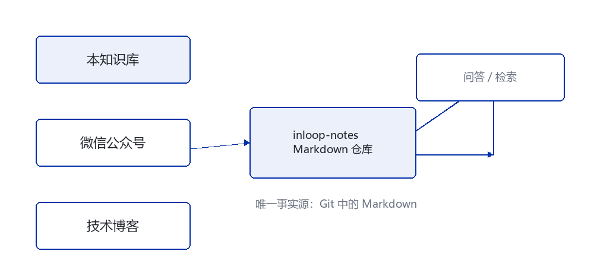

# 开篇：为什么我要把技术内容做成一个仓库

> TL;DR：技术内容分散在公众号、笔记软件、本地文档里，最终会变成一堆无法检索、无法复用、无法追溯的碎片。这个仓库想解决的问题不是"怎么发公众号"，而是"五年后我还能不能找到并复用自己写过的东西"。

## 01 · 问题

过去两年我写过一些论文笔记和实验记录，散落的位置大致有这些：

| 位置 | 内容 | 问题 |
|---|---|---|
| 微信公众号 | 成稿文章 | 不在本地，检索困难，改不了 |
| 笔记软件 | 零散想法 | 导出格式私有，图片链接会失效 |
| 本地 Markdown | 草稿 | 换电脑就丢，没有版本历史 |
| 聊天记录 | 一闪而过的判断 | 基本等于丢失 |

真正让我下决心的是去年的一次经历：我需要引用自己半年前写过的一段推导，只记得大概结论，却怎么也找不到原文——它躺在一个已经改版过的编辑器里，图片全部失效了。



## 02 · 判断

问题不在于"没有写"，而在于**内容的存储格式与平台绑定了**。

只要内容以平台为中心的格式存在，就必然出现三个后果：

1. **不可迁移。** 平台改版、服务关停、账号异常，内容就取不回来。
2. **不可检索。** 跨平台检索等于没有检索，尤其当平台不提供全文搜索时。
3. **不可复用。** 一段解释、一张图，在第二篇文章里想再用一次，只能复制粘贴，然后两份副本各自漂移。

所以我的判断是：**内容必须以纯文本形式、以平台无关的结构保存在版本控制系统里**，平台只是渲染目标之一。

## 03 · 方案

核心思路一句话：**Git 里的 Markdown 是唯一事实源，公众号是第一个渲染目标。**

```text
Markdown（唯一事实源）
    │
    ├── 渲染 → 微信公众号 HTML
    ├── 渲染 → 技术博客
    └── 索引 → README 文章列表
```

具体做法上有几条约束，是为了让这套东西五年后还能用：

- **一篇文章一个目录。** 正文、封面、配图放在一起，不依赖外部图床。
- **元数据写在正文开头的 YAML 里。** 标题、日期、标签、状态都是结构化字段，可以被程序读取。
- **图片用相对路径引用。** 不写绝对路径，换机器不影响。
- **状态显式记录。** 一篇文章处于 `idea`、`draft` 还是 `published`，是可查询的事实，不靠记忆。
- **渲染产物可重建。** `dist/` 目录随时可以删除，重新生成。

## 04 · 我的理解

这套做法有个容易被误解的地方：它看起来是"为了自动化发布"，但**自动化不是目的**。

我真正的目的是让内容**变得可维护**。可维护意味着：

- 想改一篇旧文章，能找到、能改、能看出改了什么；
- 想复用一段内容，能引用而不是复制；
- 想知道自己写过哪些主题，能列出清单而不是凭记忆；
- 想换一个发布平台，不用重写内容。

发布自动化只是这条路上的自然结果，不是起点。先把内容管好，再谈自动化，顺序反过来会本末倒置——为了自动化去迁就平台格式，最后内容又被平台绑死了。

## 05 · 参考资料

- [Git 官方文档](https://git-scm.com/doc)：版本控制的基础
- [Markdown 规范（CommonMark）](https://commonmark.org/)：正文格式的参照标准
- 本仓库的 `docs/architecture.md`：这套系统自身的结构说明

---

如果你也在被同样的问题困扰，建议先从一件事开始：**把下一篇文章用纯 Markdown 写，放进 Git。**
