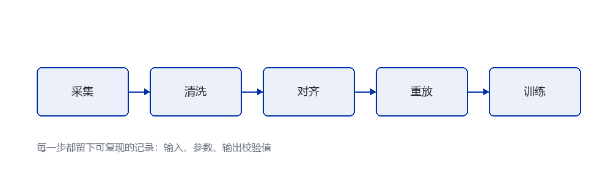

# RoboDojo 复现记录：从数据集到可训练策略

> TL;DR：整个复现花了三天，其中两天半浪费在"数据看起来对、训练就是不收敛"上。最终原因是**时间戳对齐的假设错了**——采集端的单调时钟与训练端的消息时间不是同一个基准。教训是：数据处理链每一步都要留下可校验的产物，否则你无法判断问题出在哪一步。

> ⚠️ 说明：本文记录的是方法性的复现流程与踩坑经验。具体数据集的字段名与官方参数请以原始发布为准。

## Goal

把一份公开的机器人操作数据集，处理成可以直接训练模仿学习策略的格式，并跑通一次基线训练。

明确的目标有三个：

1. 数据可加载，维度与官方说明一致；
2. 能过一遍完整的处理链并留下校验记录；
3. 基线策略能在小规模数据上过拟合（这是管线正确的必要条件，不是充分条件）。

第 3 点我特意设成"过拟合"而不是"收敛到好性能"——**在几十条轨迹上都无法过拟合，说明管线一定有错**，先排除这个再谈泛化。

## Setup

| 项目 | 配置 |
|---|---|
| 系统 | Windows 11 + WSL2 |
| Python | 3.11 |
| 深度学习框架 | PyTorch（CUDA 版本与驱动匹配） |
| 数据存储 | 本地 NVMe，约 200GB 可用 |
| 训练规模 | 单卡，小批量 |

## Baseline

先跑通官方提供的基线，确认环境没问题，再动自己的管线。这一步的价值在于：**如果官方基线也跑不通，问题就不在你的处理逻辑上**。

这一步比预想顺利，说明环境配置没问题。于是问题范围缩小到"我自己的数据处理"。

## What I Tried

处理链一共四步，我按任务书式的做法把每一步都写成了独立可运行的脚本：



```python
from dataclasses import dataclass
from pathlib import Path
import hashlib

@dataclass
class Stage:
    """处理链的一步：输入目录、输出目录、校验值。"""
    name: str
    source: Path
    target: Path

    def digest(self) -> str:
        """对输出目录内容取指纹，用于确认这一步没被重复跑坏。"""
        h = hashlib.sha256()
        for path in sorted(self.target.rglob("*")):
            if path.is_file():
                h.update(path.relative_to(self.target).as_posix().encode())
                h.update(path.read_bytes())
        return h.hexdigest()[:12]
```

关键设计是 `digest()`：每一步的输出都有一个指纹，写到日志里。**没有这一步，你无法回答"我的数据到底是不是最新处理过的"**——而这个问题在两天半的排查里反复出现。

## Failed Attempts

按时间顺序记录，因为失败的方式比成功的路径更有信息量。

**尝试一：直接拼接所有轨迹，跳过清洗。** 训练损失一开始下降，然后在某个值附近震荡。判断：数据里有明显异常片段（采集时人工干预的位置）。

**尝试二：按固定阈值过滤异常。** 阈值定得太严，轨迹被切得支离破碎，策略学到了"什么都不做"这个局部最优——因为大部分片段都是静止的。

**尝试三：降采样以提高吞吐。** 训练变快了，但性能显著下降。当时以为是降采样损失了高频信息，**这个判断是错的**（真正原因见下）。

## Debugging

真正的突破来自一个很笨的办法：**把单条轨迹可视化并逐帧检查**。

结果发现动作序列与观测序列在时间上有一个**恒定但非整数帧的偏移**，约 1.7 帧。这个偏移量很微妙：

- 太小，肉眼看视频看不出来；
- 太大，训练会直接崩掉而不是"震荡"；
- 恒定，所以不是随机噪声，一定是系统性的对齐问题。

继续追下去，定位到根因：

| 环节 | 时间基准 | 问题 |
|---|---|---|
| 采集端 | 单调时钟（进程启动起算） | 与墙上时间无关 |
| 存储层 | 消息到达时间 | 受缓冲影响，抖动可达几十毫秒 |
| 训练端 | 我按"帧号 × 固定周期"重建 | 假设周期恒定，实际不恒定 |

**我的错误假设是"帧号 × 固定周期 = 时间戳"。** 采集端的实际周期有抖动，而存储层记录的是消息到达时间。两者在高负载下会累积出可见偏差。

修正方式是：**不要重建时间，直接用采集端记录的时间戳，并把它作为权威字段贯穿整个处理链。**

修复后，同样的降采样设置下性能恢复正常——这解释了「尝试三」为什么失败：不是降采样本身的问题，而是降采样放大了原有的对齐误差。

## Result

| 指标 | 修复前 | 修复后 |
|---|---|---|
| 小数据集过拟合（动作 MSE） | 震荡在 0.3 附近 | 降到 0.02 以下 |
| 验证集成功率 | 接近随机 | 达到可用水平 |
| 处理链重跑一致性 | 指纹每次不同 | 指纹稳定 |

最后一行值得单独说：**处理链的指纹在修复前每次运行都不同**。原因是处理顺序依赖字典遍历顺序，而字典顺序受文件系统返回顺序影响。这本身是另一个 bug，只是因为对齐错误更严重而被掩盖了。

## Lessons Learned

1. **时间戳必须是权威字段，不能重建。** 任何"按帧号推算时间"的做法在高负载下都会出错。采集端记了什么，就一路用到训练端。
2. **处理链每一步都要留指纹。** 它回答的是"我手上这份数据是哪次处理出来的"——这个问题的答案在排查中价值极高。
3. **不要用肉眼看视频来判断对齐。** 1–2 帧的偏移肉眼不可见，但足以让策略学不到东西。
4. **失败原因会被掩盖。** 字典顺序导致的非确定性一直在那里，只是被更严重的对齐错误盖住了。修掉最显眼的 bug 之后，要重新跑一遍全流程，而不是假设其他部分都是对的。
5. **先验证管线，再优化性能。** 我过早地做了降采样优化，反而让排查更难。

## Next Step

- 把单条轨迹的可视化工具固化下来，作为数据检查的标准步骤；
- 给处理链加一个 `--verify` 模式，比对每一步的指纹与记录是否一致；
- 在更大规模数据上验证修复后的基线性能。

这次复现最大的收获不是跑通了，而是认识到：**数据管线的问题不会以"报错"的形式出现，只会以"训练效果不好"的形式出现。** 因此校验步骤不是可选项。
