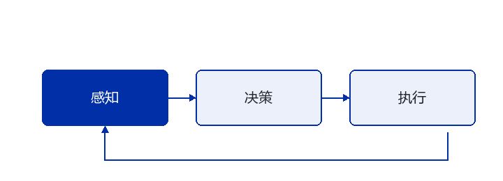

# G1 抓取任务复盘：一次失败的策略与三条可用的经验

> TL;DR：仿真里成功率 92% 的策略，上真机后接近 0。排查了两周，最终定位到三个问题：域随机化的参数范围覆盖不到真实工况、观测归一化用了仿真统计量、以及代码里的一个坐标系转换错误。前两个是方法问题，第三个是纯粹的 bug——而它被前两个问题掩盖了整整一周。

> ⚠️ 说明：本文是调试记录，重点是**排查方法**与可复用的检查清单。具体平台参数与实验配置以实际项目为准。

## 01 · 现象

训练配置大致如下：

| 项目 | 设置 |
|---|---|
| 任务 | 平面抓取并抬起 |
| 观测 | 关节角、末端位姿、目标位置 |
| 动作 | 末端目标位姿增量 |
| 仿真成功率 | 92%（随机目标位置，500 次评估） |
| 真机成功率 | 接近 0（20 次尝试，成功 1 次） |

真机上观察到的行为很有特点：**机械臂会朝着目标移动，但总是差一点**——不是完全乱动，而是系统性偏向一侧。

这个现象很重要：完全乱动说明策略没学到东西；系统性偏差说明策略学到了东西，但**输入输出之间存在固定的变换误差**。

## 02 · 排查思路

我把可能原因按"能否解释系统性偏差"做了筛选：

| 假设 | 能解释系统性偏差吗 | 排查成本 |
|---|---|---|
| 策略过拟合仿真 | 否，应表现为随机失败 | 高 |
| 域随机化不足 | 部分可以 | 中 |
| 观测归一化错误 | 可以 | 低 |
| 坐标系转换错误 | 可以 | 低 |

**先做低成本的。** 这一步省了我至少一周——因为最终确认，坐标系问题是主因。

## 03 · 找到的问题

### 问题一：坐标系转换错误（纯 bug）

反馈的末端位姿用的是世界坐标系，而动作增量是在基座坐标系下解释的。在仿真里，基座固定放在原点，两个坐标系恰好重合——**所以这个 bug 在仿真里完全不可见**。

```python
import numpy as np

def to_base_frame(pose_world: np.ndarray, base_in_world: np.ndarray) -> np.ndarray:
    """把世界坐标系的位姿转换到基座坐标系。

    仿真中基座在原点时，本函数等价于恒等变换——
    这正是这个 bug 能在仿真里潜伏很久的原因。
    """
    base_inv = np.linalg.inv(base_in_world)
    return base_inv @ pose_world
```

修复方式是在观测管线里统一坐标系，并且**在仿真里也把基座随机放置**，让这类错误无处藏身。

### 问题二：观测归一化用了仿真统计量

归一化参数是在仿真数据上统计的，而真机的传感器噪声分布不同。后果是输入特征的尺度不匹配，策略在分布外工作。



修正方式是：**归一化参数必须覆盖真实工况**，或者在真机上做少量自适应的统计校准。

### 问题三：域随机化范围太窄

| 参数 | 原随机范围 | 真机实测范围 | 是否覆盖 |
|---|---|---|---|
| 关节摩擦 | ±10% | ±25% | 否 |
| 负载质量 | 0–200g | 0–600g | 否 |
| 相机外参偏移 | ±2° | ±6° | 否 |
| 控制延迟 | 0–10ms | 10–35ms | 否 |

四项全部不覆盖。特别是**控制延迟**——它直接决定了闭环的相位裕度，在抓取这类接触任务里影响很大。

## 04 · 三条可用的经验

**第一，让仿真里的"便利假设"变成随机变量。**

基座在原点、负载固定、延迟为零——这些都是仿真里的默认便利，也正是 bug 的藏身之处。凡是仿真里"恰好成立"的假设，都应该主动打破它。

**第二，系统性偏差几乎总是变换错误，而不是学习失败。**

看到"总是差一点""总是偏一侧"这类现象，优先怀疑坐标、单位、归一化，而不是模型容量或训练时长。随机失败才更像学习问题。

**第三，按排查成本排序，不按假设的可能性排序。**

我最初认为"域随机化不足"最可能，因为它是文献里最常见的原因。但它排查成本高，而且**无法解释系统性偏差**。先做低成本的假设检验，即便最终发现主因在高成本那一侧，你也已经排除了几个干扰项。

## 05 · 修正后的验证清单

这次之后，我把下面这些检查固化成了流程，每次上真机前过一遍：

- [ ] 所有坐标系转换都有单元测试，且测试覆盖"非原点基座"
- [ ] 观测归一化统计量来自覆盖真实工况的数据
- [ ] 域随机化范围与真机实测范围逐项对照，并记录对照表
- [ ] 控制延迟在仿真里显式建模，而不是默认为零
- [ ] 仿真评估时随机化那些"平时固定"的量
- [ ] 真机首次测试先做 5 次单点验证，再做批量评估

## 06 · 我的理解

这次失败的根本原因不在任何一个具体 bug 上，而在于**我把仿真当成"便宜的实验场"，而不是"一个有自己假设的模型"**。

仿真越方便，越容易藏 bug——因为方便正是通过固定某些变量换来的。真正有效的做法不是把仿真做得更复杂，而是**主动找出仿真里"恰好成立"的假设，然后逐个打破它**。

代价是仿真训练会更慢、更不稳定。但和两周的真机排查比起来，这个代价可以接受。

## 07 · 参考资料

- [MuJoCo 文档](https://mujoco.readthedocs.io/)：接触与执行器建模的细节
- [Isaac Lab 文档](https://isaac-sim.github.io/IsaacLab/)：大规模并行仿真环境
- [GitHub · Sim2Real 相关项目](https://github.com/topics/sim2real)
